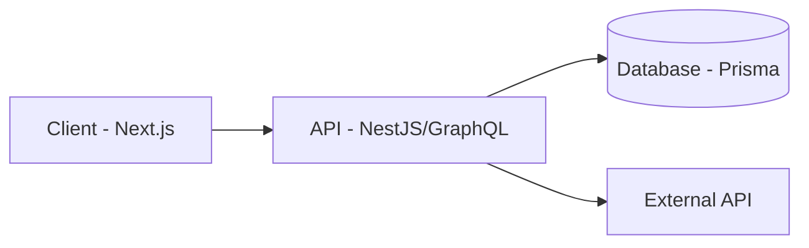

# Starbucks Homepage

[한 줄 소개 — 무엇을, 누구를 위해, 왜 만들었는지]

배포: [배포_URL] · 데모: [데모_링크] · 문서: [docs_링크]

**Stack**: React, TypeScript, NestJS, Prisma, Docker, AWS

**기간 / 인원**: 2026.XX – 2026.XX · 1인 개발

---

## 프로젝트 소개

[문제 상황]을 해결하기 위해 만든 [서비스/도구/사이드 프로젝트]입니다.

- [핵심 기능 1]
- [핵심 기능 2]
- [핵심 기능 3]

**왜 만들었는가**
[동기 — 실무에서 겪은 불편함, 학습 목적, 개인적 필요 등 1~3문장]

**성과 / 결과** (있으면 반드시 채우기)
[예: 실사용자 100명, API 응답속도 40% 개선, 수작업 30분→3분 자동화]

---

## 스크린샷

| 화면 1 | 화면 2 |
|---|---|
|  |  |

---

## 기술 스택

| 구분 | 기술 | 선택 이유 |
|---|---|---|
| Frontend | React, TypeScript, Next.js | [예: SSR로 초기 로딩 개선] |
| Backend | NestJS, GraphQL, Prisma | [예: 타입 안정성 확보] |
| Database | PostgreSQL | [예: 관계형 데이터에 적합] |
| Infra | Docker, GitHub Actions, AWS ECS | [예: 무중단 배포] |

이번 프로젝트에서 **처음 써본 기술**: [예: GraphQL, Prisma]
→ 왜 도입했는지, 기존 방식과 뭐가 다른지 한두 줄로 적어두면 학습 기록과 어필이 동시에 됨

---

## 아키텍처



설계 포인트: [왜 이 구조를 선택했는지 1~2문장]

---

## 주요 기능

**1. [기능명]**
[짧은 설명 + 스크린샷/GIF]

**2. [기능명]**
[짧은 설명 + 스크린샷/GIF]

---

## 기술적 의사결정 & 트러블슈팅

면접에서 실제로 질문받을 내용이라 생각하고 작성. "문제 → 원인 → 해결 → 결과" 순.

**[문제 1 제목: 예) MSW가 오디오 Range Request를 가로채서 시킹이 안 됨]**
- 문제: [상황 설명]
- 원인: [분석 과정]
- 해결: [적용한 해결책]
- 결과: [before/after, 개선 수치]

**[문제 2 제목: 예) Docker ARM64 vs X86_64 아키텍처 불일치]**
- 문제: [상황 설명]
- 원인: [분석 과정]
- 해결: [적용한 해결책]
- 결과: [배포 성공 여부, 소요 시간]

---

## 학습 로그

> 프로젝트를 진행하며 새로 공부하거나 깊게 파본 개념들. 나중에 "이거 어디서 배웠더라" 할 때, 그리고 면접에서 "왜 이걸 썼냐"는 질문에 바로 대답할 수 있게 남겨둠.

| 날짜 | 배운 개념 | 왜 필요했는가 | 참고 자료 |
|---|---|---|---|
| 2026-XX-XX | [예: Prisma relation query] | [예: N+1 문제 해결하려고] | [블로그/공식문서 링크] |
| 2026-XX-XX | [예: Docker multi-stage build] | [예: 이미지 용량 줄이려고] | [링크] |
| 2026-XX-XX | | | |

---

## 프로젝트 구조

```
project-root/
├── apps/
│   ├── web/            # Next.js 프론트엔드
│   └── server/          # NestJS 백엔드
├── packages/shared/       # 공통 타입/유틸
├── prisma/schema.prisma
└── docker-compose.yml
```

---

## 실행 방법

요구 사항: Node.js 18+, pnpm 8+, Docker(선택)

```bash
git clone [저장소_URL]
cd [프로젝트명]
pnpm install
cp .env.example .env
pnpm prisma migrate dev
pnpm dev
```

---

## 배포

호스팅: AWS ECS Fargate
CI/CD: GitHub Actions → Docker 빌드 → ECR 푸시 → ECS 배포

```
git push → GitHub Actions (test → build) → ECR → ECS Fargate 배포
```

<details>
<summary>배포 파이프라인 상세</summary>

```yaml
# .github/workflows/deploy.yml 핵심 부분
[워크플로우 요약 또는 링크]
```

</details>

---

## 셋업 로그

<details>
<summary>진행 중 사용한 주요 명령어 히스토리</summary>

```bash
# 2026-XX-XX  초기 생성
npx create-next-app@13.5.6 [프로젝트명] --use-pnpm --ts --tailwind --eslint

# 2026-XX-XX  DB 설정
pnpm add prisma @prisma/client
pnpm dlx prisma init
pnpm prisma migrate dev --name init

# 2026-XX-XX  배포 이슈 해결 (ARM64 → X86_64)
docker buildx build --platform linux/amd64 -t [이미지명] .
```

</details>

---

## 회고

- 배운 점: [기술적으로 얻은 것]
- 아쉬운 점: [시간 부족으로 못한 것, 있는 그대로]
- 다음 계획: [구체적인 다음 스텝]

부족한 점을 솔직하게 적는 게 오히려 성장 가능성으로 읽힙니다. 잘한 척보다 정직하게.

---

## 향후 개선 계획

- [ ] 테스트 코드 작성 (Jest, Vitest)
- [ ] 성능 모니터링 도입 (Sentry, Datadog)
- [ ] CI 파이프라인에 E2E 테스트 추가

---

[이름] · [이메일] · [GitHub] · [블로그/포트폴리오]
